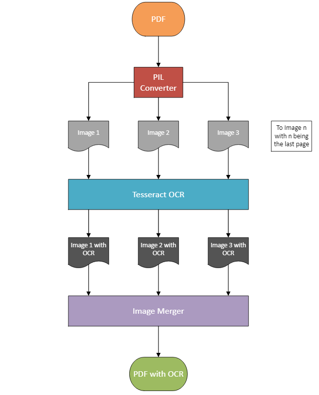

# HEA-OCR

### Purpose
This program performs optical character recognition (OCR) on a PDF using the open-source Tesseract engine. It will specifically be used to OCR the Historic Education Archive (HEA) at James E. Walker Library. By OCR-ing these documents, we can provide better accessibility and open up more opportunities for textual analysis.

### Prerequisites
- pdf2image (converts PDF into multiple Python Image Library (PIL) objects)
- Pytesseract (OCR engine that converts PIL objects into PDFs)
- PyPDF2 (merges the OCRed PDFs into one OCRed PDF)

### Installation
```bash
pip install pdf2image
pip install pytesseract
pip install PyPDF2
!sudo apt-get install -y poppler-utils
```

### Workflow


